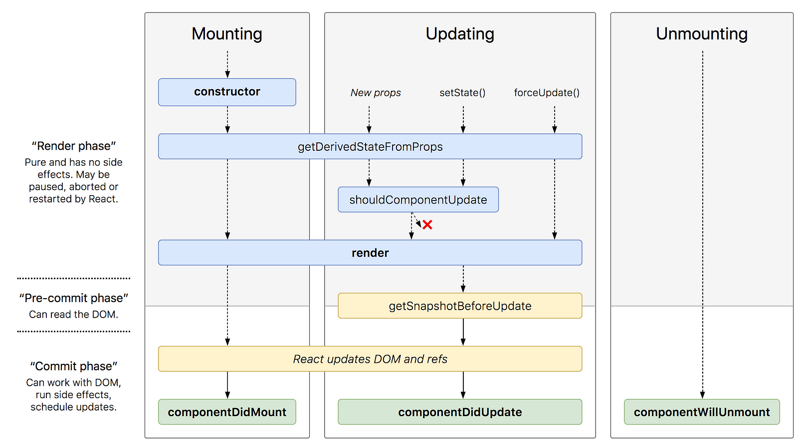

# Component Lifecycle



## Initialization

This is the phase where the component is constructed with the given Props and default state. This is done in the constructor of a Component Class.

1. The **constructor()** method constructs the object. This may call the super constructor with the props object if any specific props are being set.

## Mounting

This is the phase of rendering the JSX returned by the render method itself. Four methods are called in this order:

1. **componentWillMount()** Function. This function is invoked right before the component is mounted on the DOM.

2. The **getDerivedStateFromProps()** method is used only when the state depends on the changes
to props.

3. The **render()** method is mandatory in a React component. This method makes the component appear. It must return a DOM element and it can return only one root element.

4. The **componentDidMount()** method is invoked immediately after a component is mounted or inserted into the DOM tree.

## Updating

This phase is when the component is rendered on a change of state or properties (props). Five methods are called in this order:

1. The **getDerivedStateFromProps()** method is used only when the state depends on the changes to props.

2. The **shouldComponentUpdate()** method by default returns true. Every time there is a change in state, this method is called to check if the component should update. It is not called during the initial creation of the component. Make this method return false only if you don’t want to render the changes in state.

3. The **render()** method is the same render() method used in mounting, but here it updates the component.

4. The **getSnapshotBeforeUpdate()** method is invoked just before the changes are rendered. It helps keep track of what has changed.

5. Any value returned by this lifecycle will be passed as a parameter to the **componentDidUpdate()** method and componentDidUpdate() is invoked immediately after updating occurs. When the state of the component App is changed, it is updated.

```jsx
import React from 'react';

class App extends React.Component {
  state = {counter: 0};

  incrementCounter = () => this.setState({counter: this.state.counter + 1});

  shouldComponentUpdate() {
    console.log('shouldComponentUpdate');
    return true;
  }

  getSnapshotBeforeUpdate(prevProps, prevState) {
    console.log('getSnapshotBeforeUpdate');
    console.log('Pre: ' + prevState.counter);
    console.log('New: ' + this.state.counter);
    return prevState;
  }

  componentDidUpdate = () => console.log('componentDidUpdate');

  render() {
    return (
      <div>
        <button onClick={this.incrementCounter}>Click Me!</button>
        {this.state.counter}
      </div>
    );
  }
}
```

## Unmounting

Unmounting is when the component is removed from the document object model (DOM). When a component is unmounted or removed from the DOM tree, the **componentWillUnmount()** method is called.
