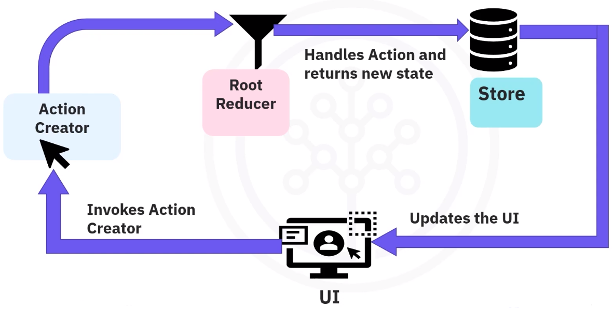

# Redux

Redux is a centralized state management library that is often used with React to handle the state of your application. It follows a pattern known as the Flux architecture. In the Flux pattern, shared information is not stored in components but in a single object.

Redux enables you to share data from one component to another without providing any state or method for its children components, allowing you to manage your app’s state in a single place.

**Store**

- Is the singular location and authoritative source of the app state.
- There is a single Store per Redux application.
- It is an object, not a class, and besides your application’s state, it contains functions and other objects.
- A Store can dispatch and receive actions. However, the Store does not perform any changes to the application state.
- You can subscribe to listen to events whenever the Store updates.

**Actions**

- Actions can be dispatched by various parts of your application (selecting a radio button, clicking a button...), and they are received by the store.
- They are payloads of information that send data from application to store.
- Actions are produced by functions called Action creators.
- They are plain JavaScript objects that describe WHAT happened, but do not describe HOW the app state will change.
- It contains type of Action, time of occurrence, and which states it aims to change.
- Actions are sent to your store instance whenever you want to update the state of your application. The rest is handled by the Reducers.

**Reducers**

- Whenever you dispatch an Action to your store, the action is passed to the Reducer. It acts as an event listener.
- Reducers are pure functions that receive the current state and the Action being dispatched. The return a new state with the actions performed.

## Async with Redux

JavaScript is a single-threaded, non-blocking, asynchronous, concurrent programming language. So, it does not wait for responses when executing a function. Redux’s state management tasks is completely synchronous. This means when an action is dispatched, it immediately generates a chain of calls to the middleware and Reducers to carry out the state transition.

You can interact with asynchronous data in your React Redux app using **middleware**.

- State changes in the Redux store are performed by triggering the actions provided by the store.
- The middleware that you use will intercept the action.
- It can also delay the actions if necessary, supporting asynchronous operations. And, once the asynchronous process completes, the rest of the Redux flow continues as usual, where the reducer receives the action to compute the new state.
- The final dispatch of the action restores the synchronous data flow.

There are many techniques that can be used as middleware for Redux. The first two are the most popular ones:

- Thunk middleware.

  In Redux, action creators are expected to return objects. However, Redux Thunk allows you to pass functions within your action creators to create an asynchronous Redux.
  Redux Thunk enables the following actions.
    - It allows writing action creators (Thunk) that return a function instead of an action.
    - It allows delaying the dispatch of an action.
    - It allows dispatching an action if a certain condition is met.

  The advantages are:
    - It is suitable for simple applications.
    - It enables async operations without a lot of boilerplate code.
    - In addition, it is easy to set up and implement and requires a smaller learning curve.

  Disadvantages:
    - It cannot directly act in response to an action.
    - It is also difficult to handle concurrency problems that may occur.
    - It is imperative, thus is not very easy to test.
    - In addition, it does not scale well because an application may expand, and you might end up with a complicated unmanageable code.

- Saga middleware.

  Redux Saga uses an ES6 feature called Generators to enable async operations. Generators make it easy to read, write and test asynchronous flows. The Saga middleware exposes a set of helper functions, or sagas, to create declarative effects that are plain JavaScript objects and they can be yielded by your sagas. The middleware will then handle the objects yielded in the backend.

  The advantages are:
  - Sagas allow expressing of complex logic as pure functions.
  - They are easy to test because pure functions are predictable, repeatable, and the effects are declarative.
  - They allow separation of concerns.
  - Sagas can be time-traveled and enable complex flow logging.
  - They make it easier to scale complex applications with side effects.
  - It is easier to catch errors and handle failures via try catch blocks.
  - Well documented.

  Disadvantages:
  - Saga middleware is not very suitable for simple apps, as it adds unnecessary indirection of triggers.
  - More boilerplate code is required compared to other middleware.
  - You need to have the knowledge of generators to fully grasp the concepts.
  - Higher learning curve is required compared to other middleware.

- Promise-based middleware.
- Async/Await middleware.

**Choosing middleware:**

Thunk is the preferred becasue:

- With Thunk, you can communicate with your actions before they reach your Reducer.
- Thunk has many use cases built around practical web apps that need to dispatch different actions. These actions depend on the response from the server.
- Thunk is an effective solution for applications with simple async requirements.
- Thunk is an approachable goal for those learning Redux the first time.

## Redux and Flow

A conventional React-Redux application comprises a single store along with a single root Reducer. As the application grows more complex, the root Reducer splits into smaller Reducers that operate on the different parts of the state tree.

The Redux elements that are involved in updating of the component properties include:

- **Central Store**: The store holds the entire application list in the form of the 'state tree'.
- **Actions**: These are information packages sent by the component with a type (description) to the reducer. Actions are simple objects which conventionally have two properties: type and payload.
- **Reducer**: This is a simple function that receives the old state and action as input and returns an updated state. Since the state is immutable, a reducer always returns a new state, which is an updated version of the previous state.
- **Subscription**: This is triggered in the components whenever the state is updated in the store.

The data flow in a React-Redux application is unidirectional.

The advantage of one-way data flow in Redux is that it is easier to manage the state when actions performed on the UI are separated.You can use some of the same containers, actions, and reducers in React Native to quickly create apps for iOS and Android.
